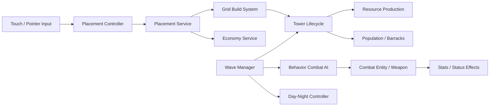

# Defense — Mobile Tower Defense Strategy

> 낮에는 자원과 방어선을 구축하고, 밤에는 몰려오는 적의 웨이브를 막아내는 Unity 기반 모바일 타워 디펜스 전략 게임입니다.

[아키텍처](docs/architecture.md) · [문제 해결 사례](docs/case-studies.md)

## 프로젝트 개요

플레이어는 제한된 자원과 인구를 관리하며 타워, 생산 건물, 병영과 성벽을 배치합니다. 서로 다른 공격 방식과 우선순위를 가진 방어 시설을 성장시키고 주기적으로 시작되는 적 웨이브로부터 핵심 거점을 지켜야 합니다.

- **엔진:** Unity 6000.3.6f1, URP 17.3
- **언어:** C#
- **플랫폼:** Android
- **협업:** 2명의 커밋 기여자, 브랜치·Pull Request 기반 개발
- **본인 기여:** 건설·경제·전투·웨이브·성장 시스템 중심

## 출시 정보

- **출시 플랫폼:** Android
- **상태:** 출시 준비 중

상용 출시를 준비 중인 프로젝트이므로 실행 파일과 전체 소스 코드는 공개하지 않습니다. 이 저장소는 담당 영역, 기술적 의사결정, 문제 해결 과정과 플레이 화면을 소개하는 채용 포트폴리오입니다.

## 핵심 게임플레이

1. 식량, 목재, 석재, 철, 골드와 인구를 관리합니다.
2. 그리드 위에 공격 타워, 생산 건물, 병영과 성벽을 배치합니다.
3. 타워를 업그레이드하고 공격 대상 우선순위를 전략적으로 활용합니다.
4. 낮에 방어선을 준비하고 밤에 시작되는 적 웨이브를 방어합니다.
5. 생산 건물의 웨이브 보상과 병영의 병력 충원으로 다음 공격에 대비합니다.

## 게임 화면

플레이 영상과 스크린샷은 공개 가능한 출시 준비 빌드를 기준으로 추가할 예정입니다.

## 주요 시스템

| 시스템 | 구현 내용 |
|---|---|
| 그리드 건설 | 다중 셀 footprint, 점유·금지 셀 검사, 배치·철거와 오브젝트 풀 연동 |
| 성벽 배치 | 두 첨탑 사이의 가로·세로 정렬을 계산해 중앙 성문과 성벽을 자동 구성 |
| 구매 트랜잭션 | 배치 가능 여부·설치 제한·보유 자원을 검증하고 실패 시 비용 환불 |
| 다중 자원 경제 | 식량·목재·석재·철·골드·인구와 변경 사유·출처를 포함한 이벤트 모델 |
| 인구 관리 | 병영이 사용할 인구를 예약하고 병사 사망·재생성·철거 과정에서 일관성 유지 |
| 타워 성장 | ScriptableObject 기반 단계별 비용과 체력·공격력·공격 속도 배율 적용 |
| 전투 구조 | 공통 전투 엔티티, 근접·원거리 무기, 직선·포물선 투사체와 효과 처리 |
| 전투 AI | Unity Behavior 기반 후보 탐색·우선순위 선택·추적·공격 행동 |
| 상태 효과 | 스탯 modifier 스택과 지속 피해·지속 회복·일시·영구 효과 관리 |
| 웨이브 | 행·간격·깊이 기반 편대 스폰, 생존 적 추적과 웨이브 완료 이벤트 |
| 주야 전환 | 웨이브 시작·종료 이벤트와 연결된 조명·환경광 보간 |
| 성능 | 적·병사·타워·투사체에 공통 오브젝트 풀링 적용 |

## 담당 영역

### 건설과 경제

- 월드 좌표와 그리드 좌표 변환, 다중 셀 점유 관리
- 타워 배치 미리보기, 회전, 모바일 드래그 입력과 삭제 흐름
- 구매·환불·설치 제한을 분리한 서비스 구조
- 생산 건물, 인구 제공 건물과 병영의 생명주기 연동

### 전투와 성장

- 전투 엔티티의 체력·이동·공격·사망 상태 통합
- 타겟 우선순위 기반 Behavior Graph 액션
- 근접·원거리 무기와 투사체 이동 전략
- 런타임 스탯 modifier와 상태 효과
- 타워 레벨별 업그레이드 비용과 성능 배율

### 웨이브와 게임 흐름

- 편대 단위 적 스폰과 생존 개체 기반 완료 판정
- 웨이브 이벤트에 연결된 생산 보상과 병영 활성화
- 낮·밤 조명 전환과 전투 준비·방어 흐름
- Bootstrapper에서 런타임 서비스 조립과 UI 연결

## 기술적 설계

자세한 구조와 선택 이유는 [아키텍처 문서](docs/architecture.md), 구현 중 해결한 문제는 [문제 해결 사례](docs/case-studies.md)에서 확인할 수 있습니다.

## 사용 기술

- **Engine & Rendering:** Unity 6.3, URP, Visual Effect Graph
- **Gameplay:** Unity Behavior, Input System, DOTween, ScriptableObject
- **Systems:** Grid Building, Economy, Wave, Runtime Stats, Status Effects
- **Platform:** Android, mobile touch input
- **Collaboration:** Git, GitHub branches, pull requests
