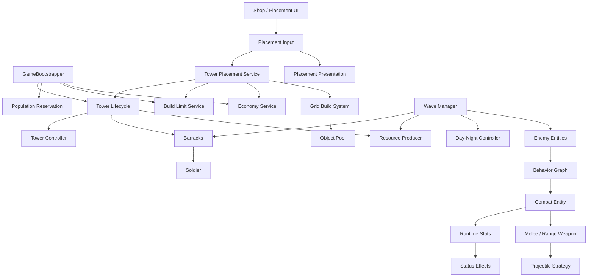
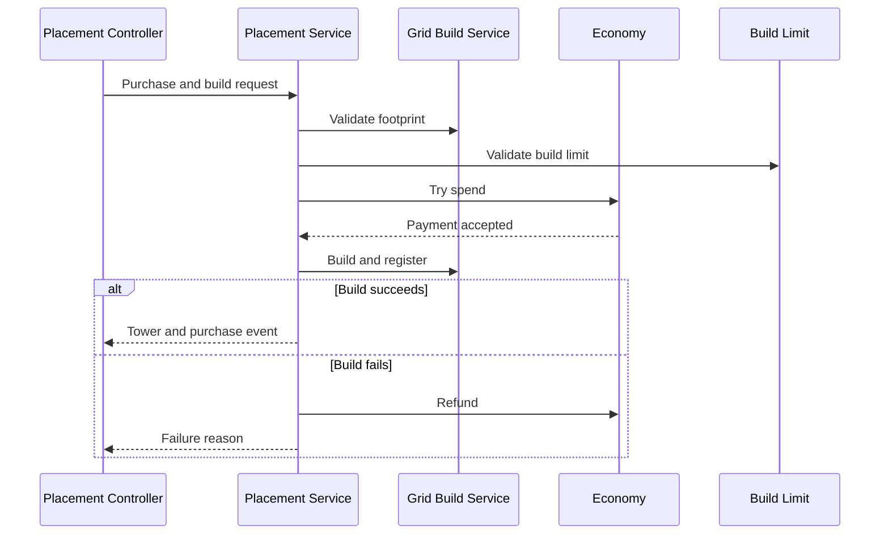

# 아키텍처

## 설계 목표

Defense는 건설, 경제, 전투, 웨이브가 서로 영향을 주는 타워 디펜스입니다. 각 시스템이 UI나 특정 프리팹에 직접 의존하지 않도록 런타임 서비스와 이벤트를 중심으로 연결했습니다.

- 다중 셀 건물과 특수 형태의 성벽을 같은 그리드에서 관리
- 비용 지출과 실제 건설 결과를 하나의 일관된 구매 흐름으로 처리
- 생산·인구·병영·설치 제한을 건물 생명주기에 맞춰 갱신
- 전투 엔티티, 무기, 투사체, 스탯과 상태 효과의 책임 분리
- 웨이브 이벤트를 주야 전환과 경제 보상에 재사용

## 전체 구조

## 런타임 조립

`GameBootstrapper`가 씬의 컴포넌트와 순수 C# 서비스를 조립합니다.

- `PlayerWallet`과 `EconomyService`
- `TowerBuildLimitService`
- `PopulationReservationService`
- `TowerPlacementService`
- `TowerLifecycleService`

UI는 필요한 서비스만 전달받으며, 전역 상태를 직접 검색하지 않습니다. 건설·철거 이벤트는 생명주기 서비스로 모여 생산 건물, 병영, 인구와 설치 제한을 갱신합니다.

## 건설 계층

### GridBuildSystem

월드 좌표를 셀로 변환하고 다음 상태를 관리합니다.

- 그리드 범위
- 이미 점유된 셀
- 배치 금지 셀
- 하나의 오브젝트가 차지하는 여러 셀
- 프리팹 footprint에 따른 중심 위치

오브젝트와 점유 셀을 함께 등록하므로 어느 셀을 선택해도 전체 건물을 찾아 제거할 수 있습니다.

### TowerPlacementService

구매와 배치 정책을 조정합니다.

검사 결과는 enum 기반 실패 사유로 반환해 UI가 자원 부족, 설치 제한, 점유 충돌을 구분할 수 있게 했습니다.

### WallSpireLayout

두 첨탑이 같은 행 또는 열에 있는지 확인한 뒤 사이의 셀을 계산합니다. 중앙 구간을 성문으로, 나머지를 성벽으로 분리하고 모든 셀의 건설 가능 여부를 사전 검증합니다.

## 경제와 인구

`EconomyService`는 식량·목재·석재·철·골드·인구를 다룹니다. 모든 변경에는 이유와 출처가 포함되어 UI 갱신뿐 아니라 구매, 생산, 보상, 환불을 구분할 수 있습니다.

인구는 일반 재화처럼 즉시 소모하지 않고 `PopulationReservationService`가 가용량을 예약합니다. 병영은 모집 슬롯마다 인구를 예약하고, 건물 비활성화 시 예약을 반환합니다.

## 전투 계층

- **CombatEntityController:** 공통 생명주기와 Behavior Graph 변수 연결
- **RuntimeStats:** 기본값 위에 source ID별 modifier 적용
- **WeaponBase:** 근접·원거리 공격 진입점
- **ProjectileMovement:** 직선·포물선 이동 전략 분리
- **CombatEffect:** 피해·회복 등 실행 효과를 ScriptableObject로 구성
- **StatusEffectController:** 지속 시간 효과와 영구 효과를 분리 관리
- **Behavior Actions:** 후보 탐색, 우선순위 선택, 추적과 공격 수행

타겟 우선순위는 거리, 체력, 체력 비율과 무작위 전략을 지원해 타워별 전투 성격을 데이터로 구성할 수 있습니다.

## 웨이브와 주야 전환

`WaveManager`는 웨이브 아래에 여러 편대를 두고, 각 편대는 행·수량·깊이·간격으로 배치를 정의합니다. 적의 사망 이벤트로 생존 수를 추적해 웨이브 종료를 판정합니다.

`WaveStarted`와 `WaveCleared` 이벤트는 다음 시스템에서 공유합니다.

- 낮과 밤의 조명·환경광 전환
- 생산 건물의 웨이브 완료 보상
- 병영의 병사 모집 시작
- 이후 UI와 게임 진행 확장을 위한 상태 알림

## 풀링

타워, 적, 병사와 투사체는 공통 `PoolManager`를 사용합니다. 프리팹별 큐와 부모 Transform을 유지하고, 중복 반환을 막는 풀 상태를 관리합니다. 생성·제거가 빈번한 웨이브 전투에서 할당과 파괴 비용을 줄입니다.
